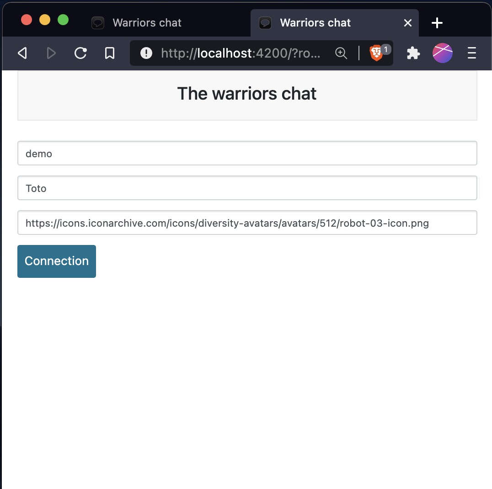
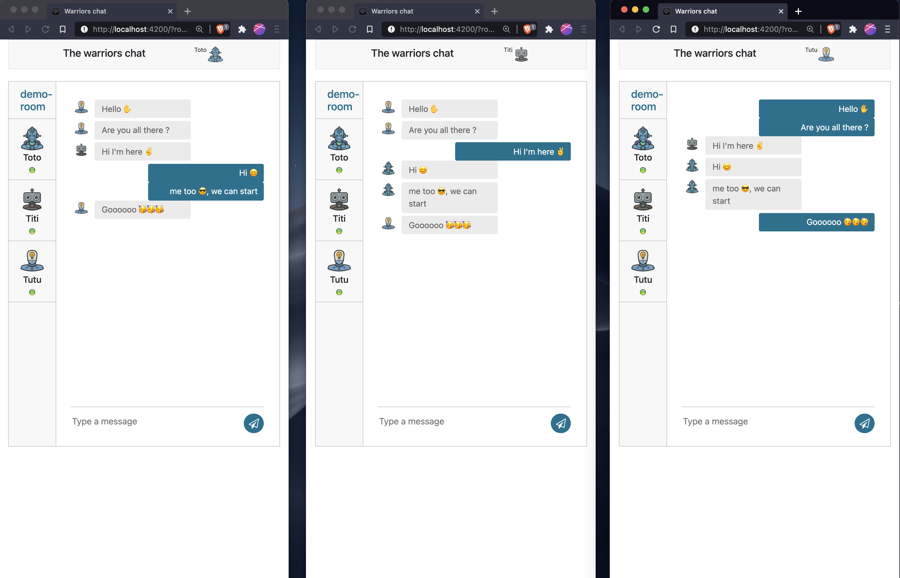
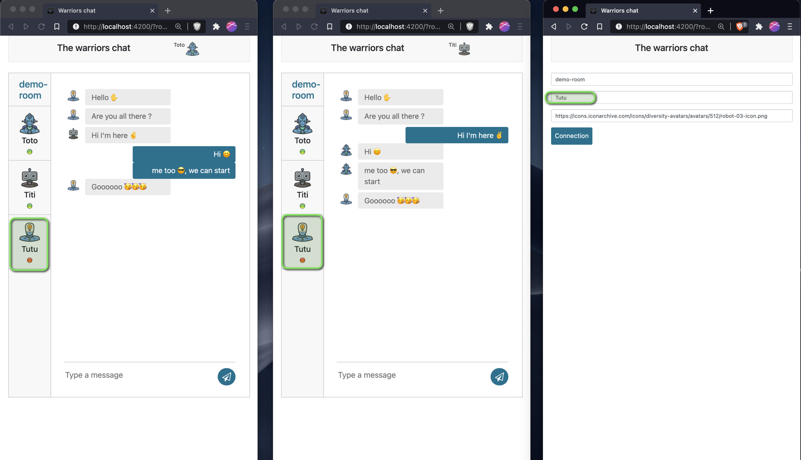

# Chat web app using Angular and Websocket

Project generated with [Angular CLI](https://github.com/angular/angular-cli) version 11.1.4.

## Build

`ng build`

## Requirements

Before running the web app we need to prepare the associated chat server, we must run the backend (chat server) and then
use the exposed APIs to manage a chat rooms (see `chat-server-with-nestjs-and-websocket` README.md)

## Run

Run `ng serve` for a dev server. Navigate to `http://localhost:4200/`.

## Connections modes

Before connecting to a room, we need to create it in the backend first, example:
To crete a room `demo-room` on the backend we call the endpoint 

    POST http://localhost:3000/api/v1/rooms

with body: 
    
    {"roomId": "demo-room","creatorUsername": "your-username"}

- ### URL mode:

  Url template: `http://localhost:4200/?room={roomId}&user={username}&avatar={avatarUrl}`

  Example: the members of `demo-room` team can chat on room `demo-room` using the following urls:

  - [connecting Toto to demo-room team chat](http://localhost:4200/?room=demo-room&user=Toto&avatar=https://icons.iconarchive.com/icons/diversity-avatars/avatars/512/robot-01-icon.png)
  - [connecting Titi to demo-room team chat](http://localhost:4200/?room=demo-room&user=Titi&avatar=https://icons.iconarchive.com/icons/diversity-avatars/avatars/512/robot-02-icon.png)
  - [connecting Tutu to demo-room team chat](http://localhost:4200/?room=demo-room&user=Tutu&avatar=https://icons.iconarchive.com/icons/diversity-avatars/avatars/512/robot-03-icon.png)

- ### UI mode:

  The members can also chat on room `demo-room` using the UI:

  

## The chat 😉

## Connection status (ex: reconnection)

## Websocket config

Create Socket config on `app.module.ts`
like: `const config: SocketIoConfig = { url: 'http://localhost:3000', options: {}};`
and then add this module Socket config `SocketIoModule.forRoot(config)` on `imports`. It will connect the Socket part of
the app to the server.
  
